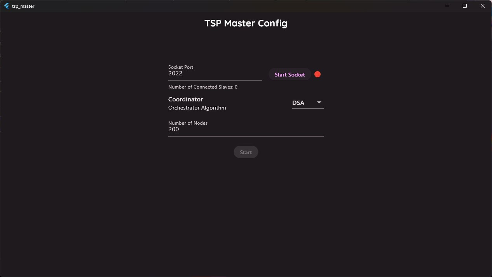

# Distributed TSP

Cloud Computing Exercise Project

Professor: Dr. Saeed Sedighian Kashi

# How to Run

1. Download the Master & Slave application from releases

1. Open The Master App:

1. You can customize the algorithm but it's seggested to set the coordinator to `DSA`:

1. Start Socket
1. Open as many Slave instances as you want and press `Enter` to connect to the default address or enter custom address and then press `Enter`:

1. Click the start button in the Master application.
1. You should see the master and slaves start working to solve the randomly generated tsp problem:
